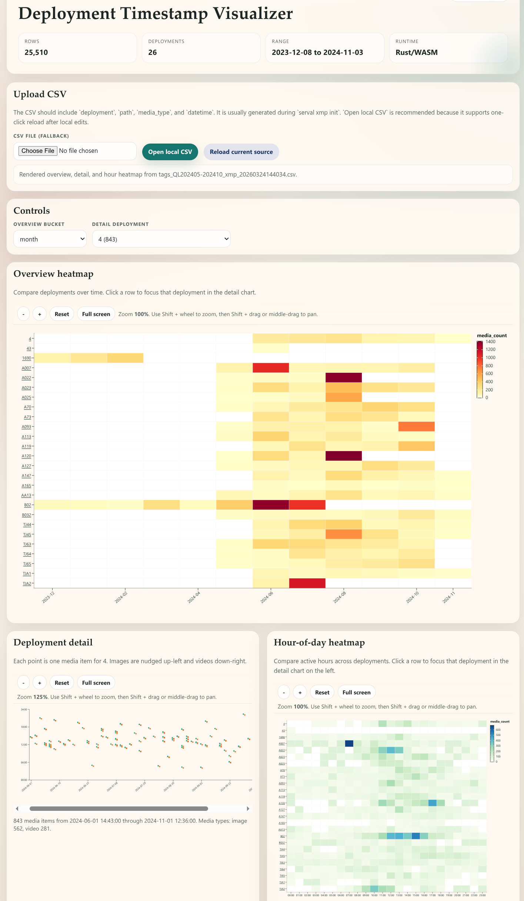

# Deployment Timestamp Visualizer

Media timeline explorer built with `polars`, `charton`, and `wasm-bindgen`.

## Overview
This project ships as a local WASM web app by default. Running the binary starts a local server and opens an interactive browser interface for exploring media timestamp distributions by deployment.  

It is part of the [Serval](https://github.com/wsyxbcl/Serval) workflow where users review timestamps and deployments.

## Screenshot



## Run 

Start the local WASM server:

```bash
cargo run
```

Or explicitly:

```bash
cargo run -- serve-wasm --bind 127.0.0.1:8787
```

## Build

Rebuild the browser bundle:

```bash
cd web
wasm-pack build --release --target web --out-dir pkg
```

Build the native binary:

```bash
cd ..
cargo build --release
```
